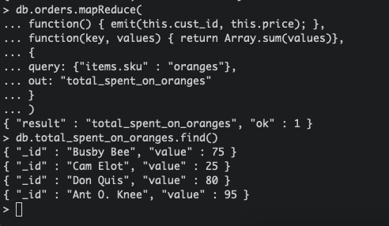

### DAT250: Software Technology Experiment Assignment 3

* Technical problems
  - I only encountered one problem when installing MongoDB, and that was I didn't manage to validate
  the package. I used brew when installing, so I figured it would probably install the proper version, and
  that it wouldn't matter to much about the validation. 
* Screenshots:
  - Experiment 1  
   I implemented these in Java. It is not included the actual code, since it's pretty much
   straight forward the same as in the tutorial.  
  Insert Documents:  
  
  Query Documents:
  
  Update Documents:
  
  Remove Documents:  
  (deleted Documents where status = "A")
  
  Bulk write  
  This one I didn't implement in Java, I just wrote in right into the shell
  
    
  - Experiment 2  
  From the tutorial, first map reduce:  
    
  Second map reduce:  
    
  My own map reduce, how much each costumer spent on oranges:  
    
  This might not be the most useful map reduce in the history of map reduces, maybe ever, but it does give a short
  example of how you can use map reduce to find for example averages over documents stored in MongoDB databases.
  
 * Pending issues  
 I did not manage to validate the installation packages
  
  
